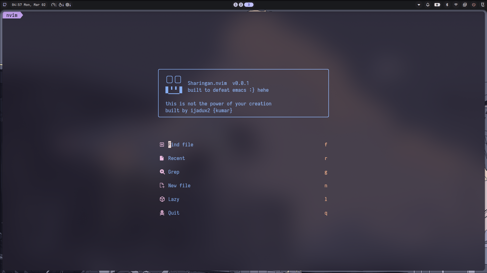
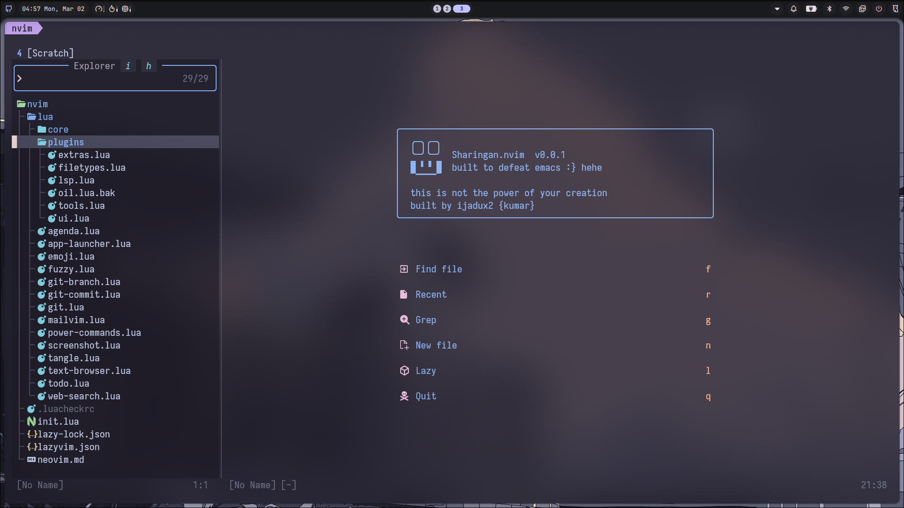
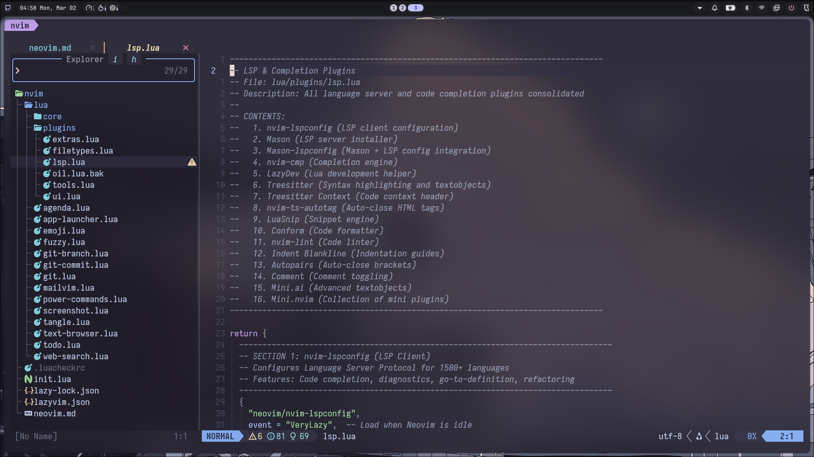
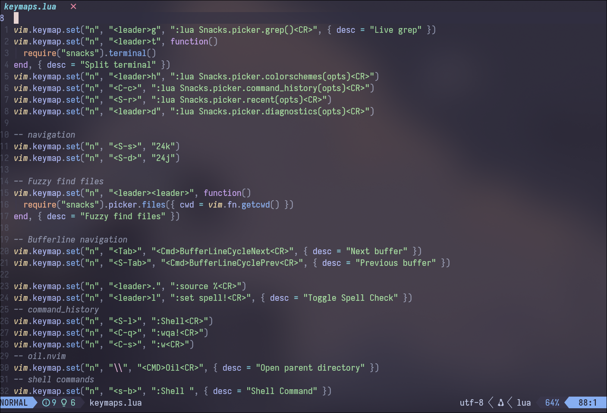
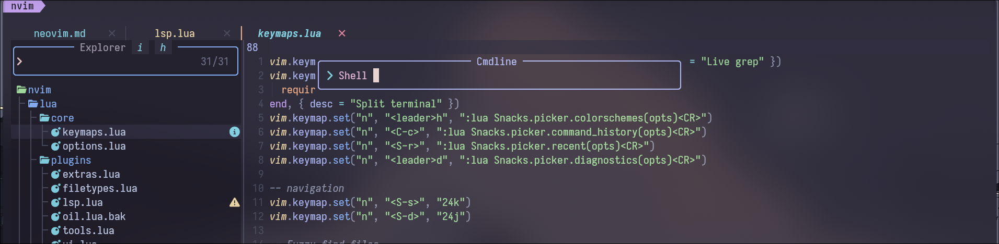
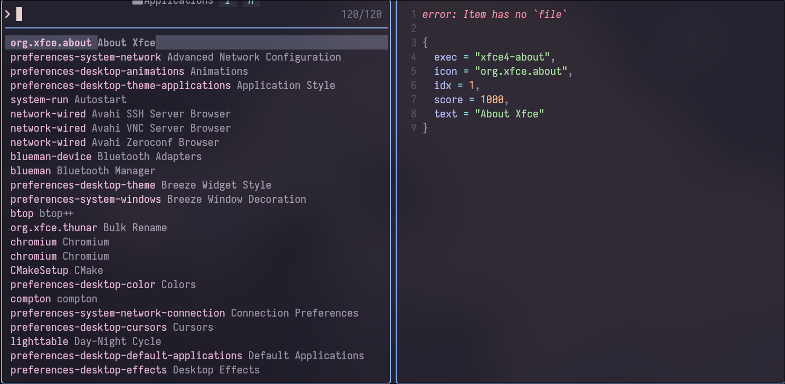

# Sharingan.nvim

A highly customized Neovim configuration built on LazyVim, featuring a powerful picker system powered by Snacks.picker and numerous native Lua modules for enhanced productivity.

## Features

### Screenshots








### Core Configuration

- **Plugin Manager:** Lazy.nvim
- **Colorscheme:** Catppuccin
- **LSP:** Mason.nvim with nvim-cmp
- **Treesitter:** Advanced syntax highlighting
- **Fuzzy Picker:** Snacks.picker
- **File Explorer:** Snacks.picker / Oil

### Custom Lua Modules

| Module               | Description                                                                                      | Keybinding   |
| -------------------- | ------------------------------------------------------------------------------------------------ | ------------ |
| `fuzzy.lua`          | Fuzzy finder for files, buffers, git files, recent files, commands, keymaps, help tags, and grep | `<leader>ff` |
| `app-launcher.lua`   | Application launcher for Linux                                                                   | `<leader>fa` |
| `emoji.lua`          | Emoji picker with category filtering                                                             | `<S-e>`      |
| `git.lua`            | Git branch switching, commit, and log viewer                                                     | `<leader>gg` |
| `git-branch.lua`     | Quick branch switcher                                                                            | `<leader>gb` |
| `git-commit.lua`     | Git commit helper                                                                                | `<leader>gc` |
| `power-commands.lua` | System controls: power, media, brightness, screenshot                                            | `<leader>fp` |
| `web-search.lua`     | Search the web from Neovim                                                                       | `<leader>fs` |
| `text-browser.lua`   | Browse URLs in terminal                                                                          | `<leader>fb` |
| `agenda.lua`         | Markdown note creator                                                                            | `<S-f>`      |
| `todo.lua`           | Todo management                                                                                  | `<leader>ft` |
| `tangle.lua`         | Extract code blocks from markdown                                                                | `:Tangle`    |
| `screenshot.lua`     | Screenshot utilities                                                                             | `<leader>fS` |
| `mailvim.lua`        | Email client integration                                                                         | `<leader>fm` |

## Installation

```bash
# Backup existing Neovim config
mv ~/.config/nvim ~/.config/nvim.bak

# Clone this repository
git clone https://github.com/ijadux2/sharingan.nvim.git ~/.config/nvim

# Start Neovim
nvim
```

Lazy.nvim will automatically install all plugins on first launch.

## Keybindings

### General

| Binding   | Action                  |
| --------- | ----------------------- |
| `<Space>` | Leader key              |
| `<Esc>`   | Clear search/highlights |
| `jk`      | Exit insert mode (fast) |
| `H`       | Beginning of line       |
| `L`       | End of line             |
| `J`       | Move line down          |
| `K`       | Move line up            |

### Fuzzy Finder & Pickers

| Binding      | Action               |
| ------------ | -------------------- |
| `<leader>ff` | Fuzzy finder menu    |
| `<leader>fa` | App launcher         |
| `<leader>fg` | Git files            |
| `<leader>fr` | Recent files         |
| `<leader>fc` | Commands             |
| `<leader>fh` | Help tags            |
| `<leader>f/` | Grep search          |
| `<S-e>`      | Emoji picker         |
| `<S-f>`      | Create markdown note |

### Git

| Binding      | Action        |
| ------------ | ------------- |
| `<leader>gg` | Git menu      |
| `<leader>gb` | Switch branch |
| `<leader>gc` | Git commit    |

### System & Power

| Binding      | Action          |
| ------------ | --------------- |
| `<leader>fp` | Power commands  |
| `<leader>fS` | Screenshot menu |
| `<leader>fs` | Web search      |
| `<leader>fb` | Text/browser    |

### Window Navigation

| Binding | Action         |
| ------- | -------------- |
| `<C-h>` | Navigate left  |
| `<C-j>` | Navigate down  |
| `<C-k>` | Navigate up    |
| `<C-l>` | Navigate right |

## Requirements

- Neovim >= 0.9.0
- Git
- ripgrep (for grep functionality)
- For full functionality:
  - `brightnessctl` - Brightness control
  - `wpctl` - PipeWire volume control
  - `playerctl` - Media player control
  - `maim` - Screenshots
  - `xdg-open` - Open URLs
  - `nmcli` - WiFi control
  - `rfkill` - Bluetooth control

## Project Structure

```
.
├── init.lua              # Main entry point
├── lazyvim.json          # LazyVim compatibility
├── lazy-lock.json       # Locked plugin versions
├── lua/
│   ├── core/
│   │   ├── options.lua   # Neovim options
│   │   └── keymaps.lua   # Keybindings
│   ├── plugins/
│   │   ├── ui.lua        # UI plugins
│   │   ├── lsp.lua       # LSP configuration
│   │   ├── tools.lua     # Tool plugins
│   │   ├── filetypes.lua # Filetype plugins
│   │   └── extras.lua    # Extra plugins
│   ├── fuzzy.lua         # Fuzzy finder
│   ├── app-launcher.lua  # App launcher
│   ├── emoji.lua         # Emoji picker
│   ├── git.lua           # Git integration
│   ├── power-commands.lua # System controls
│   ├── web-search.lua    # Web search
│   ├── agenda.lua        # Note taking
│   └── ...
└── neovim.md            # Documentation source
```

## Tangle

This configuration uses its own `tangle.lua` module to extract code blocks from `neovim.md` into the actual Lua files. Run `:Tangle` in Neovim to regenerate the source files from the markdown documentation.

## License

MIT
